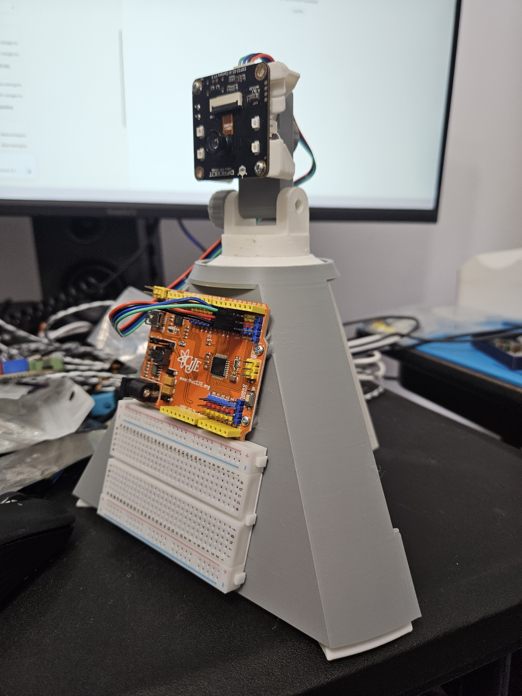

# Getting Started with the AI Camera

So you've got an ESP32-S3 AI CAM and you want to make it smart. This guide will walk you through everything step by step — no prior experience needed. If you can connect to WiFi and paste a key, you can do this.



---

## What You're Building

By the end of this guide, you'll have a camera that:
- Streams live video to your phone or laptop
- Takes photos and records audio
- Sends what it sees and hears to OpenAI (ChatGPT's brain) and gets a response
- Talks back to you with a speaker

All controlled from a web page on your browser. No app download needed.

---

## What You Need

| Item | Notes |
|------|-------|
| **ESP32-S3 AI CAM** | The DFRobot DFR1154 board specifically |
| **Micro SD card** | Any size works, 4GB+ is fine |
| **USB-C cable** | To connect the board to your computer (make sure it's a data cable, not charge-only) |
| **A computer with Chrome or Edge** | The flasher only works in these browsers |
| **WiFi network** | Your home WiFi — you'll need the name and password |
| **OpenAI API key** | We'll walk through how to get one below |

---

## Step 1: Get an OpenAI API Key

This is what lets the camera talk to ChatGPT's brain. You'll need a parent or guardian to help with this part since it requires a payment method.

1. Go to [https://platform.openai.com/signup](https://platform.openai.com/signup)
2. Create an account (or sign in if you already have one)
3. Go to [https://platform.openai.com/api-keys](https://platform.openai.com/api-keys)
4. Click **"Create new secret key"**
5. Give it a name like "AI Camera"
6. Copy the key — it starts with `sk-` and is a long string of characters
7. **Save it somewhere safe.** You can't see it again after you close the popup.

> **Heads up:** OpenAI charges a small amount per use (usually pennies per request). It's not free, but it's cheap. Ask a parent to set a monthly spending limit in the OpenAI dashboard under **Settings > Limits** so there are no surprises.

---

## Step 2: Flash the Firmware

This is the part where you load the camera software onto the board. No coding, no Arduino IDE, no installs — just your browser.

1. Make sure your **SD card is inserted** into the camera board
2. Plug the ESP32-S3 AI CAM into your computer with the **USB-C cable**
3. Open **Chrome** or **Edge** on your computer (other browsers won't work for this step)
4. Go to the flasher page (your instructor will give you the URL)
5. Click **"Flash Firmware"**
6. A popup will ask you to pick a serial port — select the one that showed up when you plugged in the board
7. Wait for it to finish. You'll see a progress bar.

> **Nothing showing up when you click Flash?** Try a different USB cable — some cables only charge and can't transfer data. Also try holding the **BOOT** button on the board while clicking Flash, then let go after it starts.

---

## Step 3: Connect the Camera to Your WiFi

Once the firmware is flashed, the camera will restart automatically and create its own WiFi network.

1. On your phone or laptop, go to your WiFi settings
2. Look for a network called **AI-Camera-Setup**
3. Connect to it (there's no password)
4. A setup page should open automatically. If it doesn't, open a browser and go to `http://192.168.4.1`

You'll see a dark-themed setup page that looks like this:

5. Click **"Scan for Networks"** — your home WiFi networks will appear
6. Tap your WiFi network name
7. Type your WiFi password
8. Paste your **OpenAI API key** from Step 1 into the API key field
9. Click **"Connect & Start Camera"**

The camera will try to connect. If it works, you'll see a success message with an IP address like `192.168.1.42`. The camera will restart on its own.

> **Connection failed?** Double-check your WiFi password. The most common mistake is a typo. Click Scan again and try once more.

---

## Step 4: Open the Camera Interface

1. Make sure your phone or computer is back on your **home WiFi** (not "AI-Camera-Setup" anymore)
2. Open any browser (Chrome, Safari, Firefox, whatever)
3. Type the IP address from Step 3 into the address bar: `http://192.168.1.42` (use your actual IP)
4. Hit Enter

You should see the camera interface load up:


That's it. You're in.

---

## Using the Camera

Here's what all the buttons do:

### Video
- **Video Stream** — Starts/stops the live video feed
- **Capture** — Takes a photo and saves it to the SD card
- **Review** — Shows the last photo you took

### Audio
- **Record** — Records audio from the microphone (5 seconds by default)
- **Speaker** — Plays back audio through the speaker

### Files
- Each image and audio file shows up in a list on the right
- **Add to Export** — Queues a file to send to OpenAI
- **Save to PC** — Downloads the file to your computer
- **Delete File** — Removes it from the SD card

### AI Analysis
1. Capture a photo (or a few — you can send up to 5 at once)
2. Click **Add to Export** on the images you want analyzed
3. Record audio and click **Add to Export** on the audio file too
4. Click **Send to OpenAI**
5. Wait about 60-90 seconds — you'll see a progress bar
6. The AI's response will appear in the message box at the bottom
7. Click **Replay TTS** to hear the response spoken out loud

---

## Troubleshooting

| Problem | Fix |
|---------|-----|
| Can't find "AI-Camera-Setup" WiFi | Make sure the firmware flashed successfully. Try unplugging and replugging the board. |
| Setup page won't load | Try going to `http://192.168.4.1` manually in your browser. |
| WiFi won't connect | Double-check your WiFi password. Make sure there are no extra spaces. |
| "SD Card FAIL" in serial monitor | Make sure an SD card is inserted. Try formatting it as FAT32. |
| Can't open the camera web page | Make sure your device is on the same WiFi as the camera. Use `http://` not `https://`. |
| OpenAI analysis fails | Check that your API key is correct and has credits loaded. |
| Want to start completely over | Hold the **BOOT** button on the board for 3 seconds. This factory resets the camera back to the setup screen. |

---

## What's on the SD Card

The camera organizes everything into folders:

```
/images/       — All captured photos (JPEG)
/audio/        — All recorded audio (WAV)
/tts/          — Text-to-speech audio responses (MP3)
/analysis/     — AI analysis results, organized by timestamp
```

---

## For Advanced Users / Instructors

If you want to skip the web flasher and use Arduino IDE instead:

1. Open `ai_camera/code/ai_camera_unified/ai_camera_unified.ino` in Arduino IDE
2. Install the **ArduinoJson** library (Tools > Manage Libraries)
3. Board settings: ESP32S3 Dev Module, USB CDC On Boot: Enabled, Flash: 16MB, Partition: 16M Flash (3MB APP/9.9MB FATFS), PSRAM: OPI PSRAM
4. Upload. The setup portal will handle WiFi and API key configuration — no code editing needed.

To compile a `.bin` for the web flasher: use **Sketch > Export Compiled Binary** in Arduino IDE, then copy the `.bin` to the `web_flasher/` folder as `firmware.bin`.

---

That's it. You've got a working AI camera. Take some photos, ask the AI what it sees, and start experimenting.
